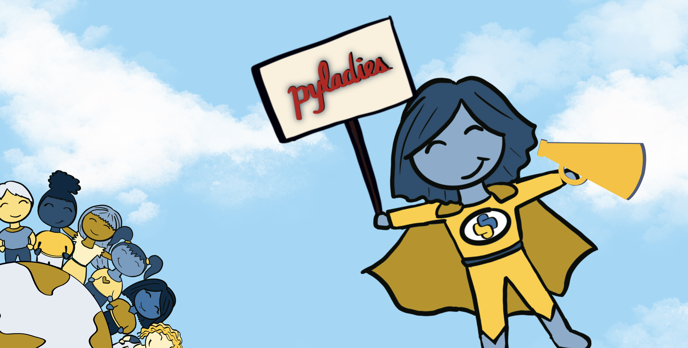
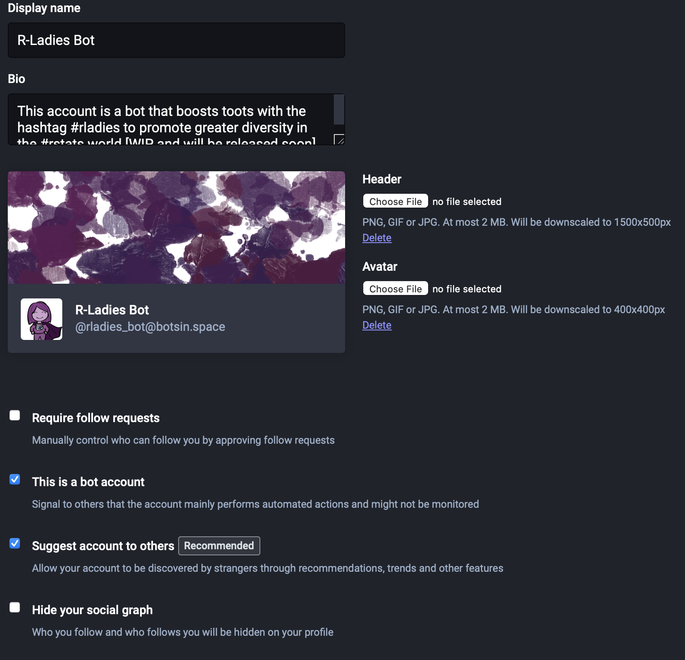
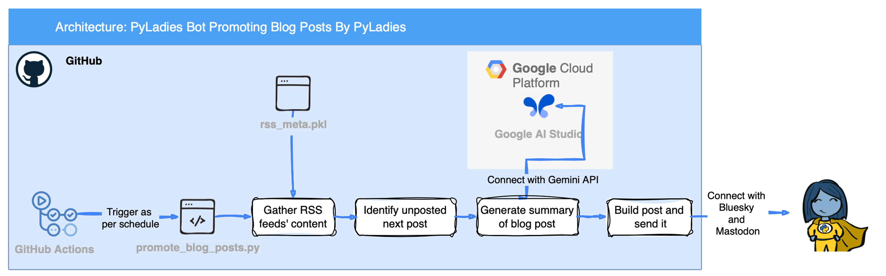
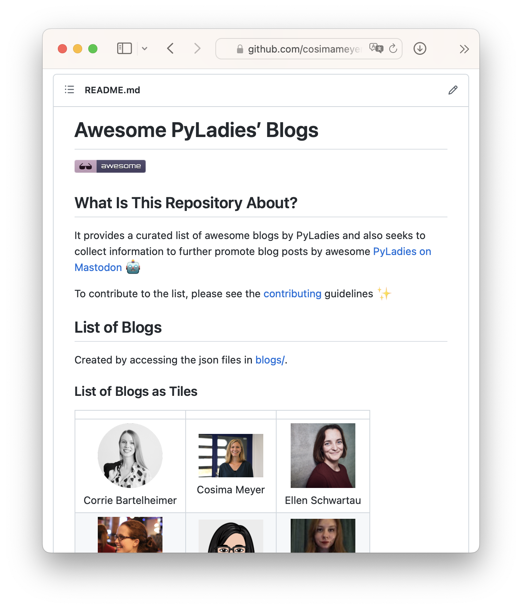
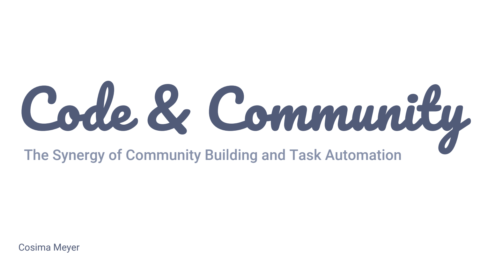
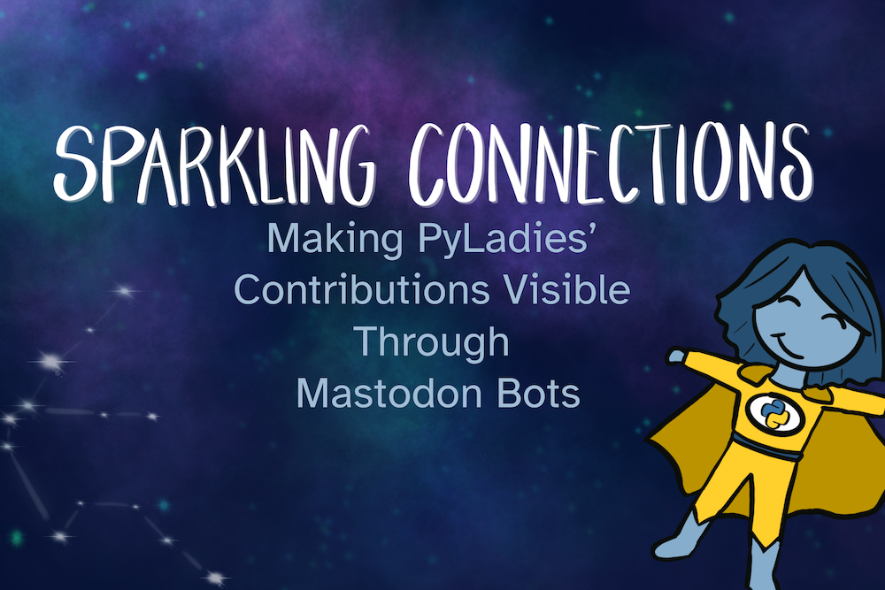
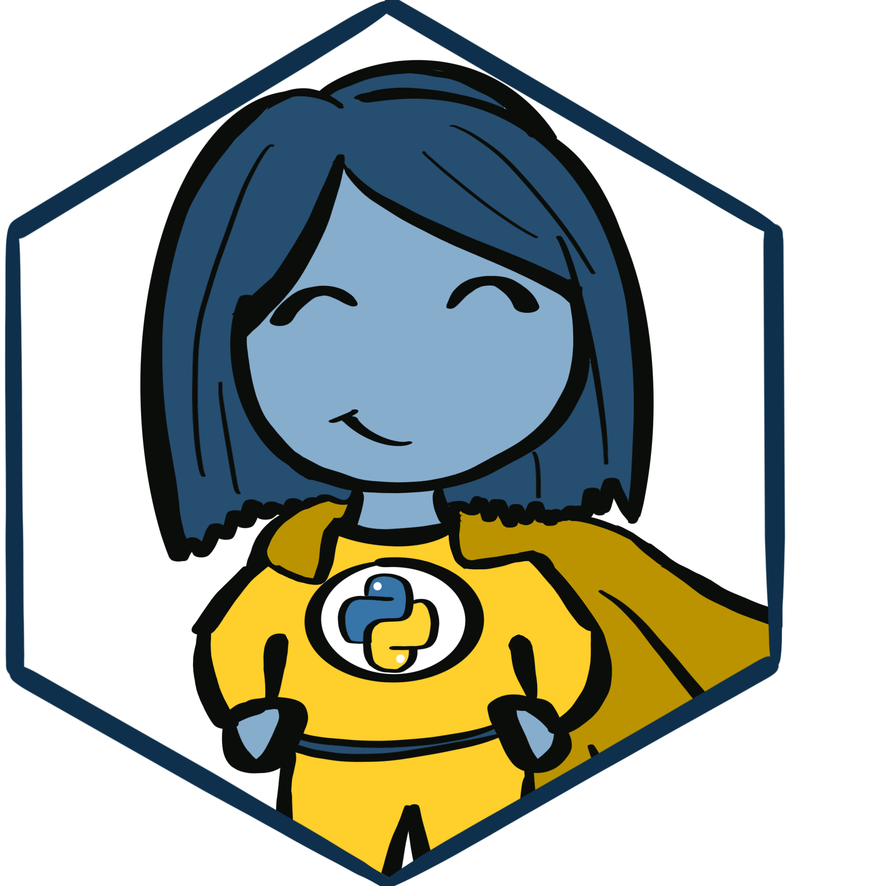
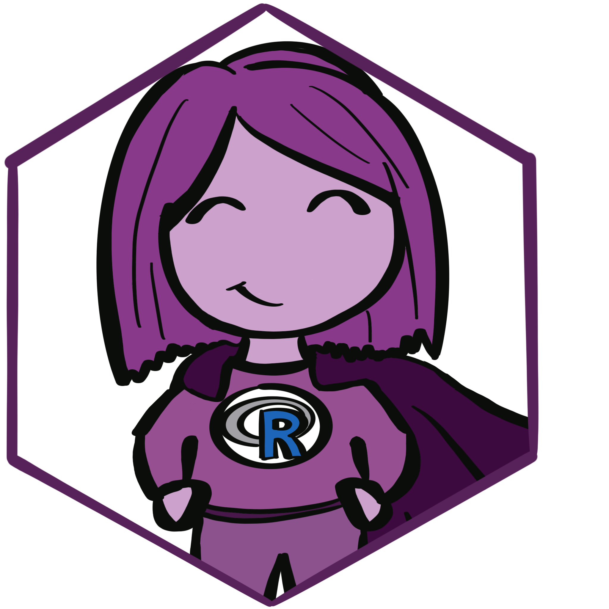

# Welcome 👋

## What This Project is About

This project focuses on building community-driven bots for Bluesky and Mastodon to support and grow the Python, R, and data community. The bots help by 

- Boosting posts tagged with #pyladies or #rladies, 
- Sharing portraits of amazing women in tech, 
- Posting useful resources by PyLadies and R-Ladies, and 
- Celebrating community achievements. 

With these bots, I hope to give others an automated megaphone to increase visibility for underrepresented groups in the tech space.

Designed to increase engagement and visibility, the bots run automatically open-source tools. The project also provides a detailed, open guide for others interested in setting up similar bots. At its core, it’s about using automation to strengthen and connect our communities.

This projects marries multiple components:

- Sharing content by [**PyLadies**](https://github.com/cosimameyer/awesome-pyladies-blogs) and [**R-Ladies**](https://github.com/rladies/awesome-rladies-blogs)
- [**Sharing Amazing Women in Tech**](https://gallery.cosimameyer.com/amazing-women-in-tech/)

Here is more about the project:

### Blog Posts 

-   [**Building Mastodon Bots**](https://cosimameyer.com/post/2023-09-17-building-mastodon-bots-and-promoting-the-community-part-2/)
    

-   [**How to add Gemini to your Python project**](https://cosimameyer.com/post/how-to-add-google-gemini-to-your-python-project-that-makes-use-of-github-actions/)

    

-   [**Awesome PyLadies' Repository**](https://cosimameyer.com/post/2023-04-25-building-mastodon-bots-and-promoting-the-community/)
    

### Talks

-   [**Code & Community @ PyConDE/PyData 2025**](https://drive.google.com/file/d/1vMlaJ3vbV7ONJg24dqBFIUp6sJUjYL_u/view)
    
-   [**Sparkling Connection @ PyLadiesCon 2023**](https://bit.ly/pyladiescon2023-slides)
    

## Where can I find the bots?

You can find the bots on Bluesky (and formerly also on Mastodon). I'd love to extend it to other platforms - so if you have ideas, let me know!

### Bluesky 

-   __PyLadies Bot__

    
    [:octicons-arrow-right-24: Hop over to Bluesky and meet the bot](https://bsky.app/profile/did:plc:cyhjdt4mp7h4c2ufw3nwcqqx)

-   __R-Ladies Bot__

    
    [:octicons-arrow-right-24: Hop over to Bluesky and meet the bot](#)

### Mastodon 

!!! info "" 
    👋 Those bots are currently looking for a new home (i.e., an instance at Mastodon). If you know of something, please feel free to reach out!
